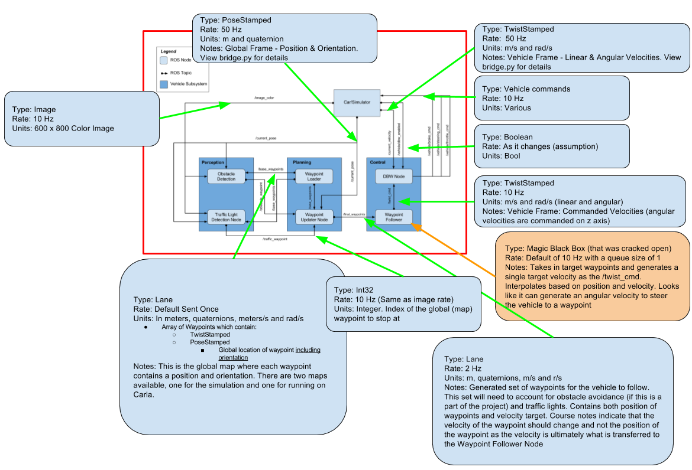
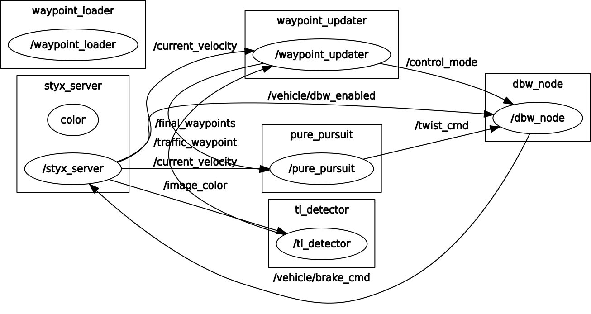
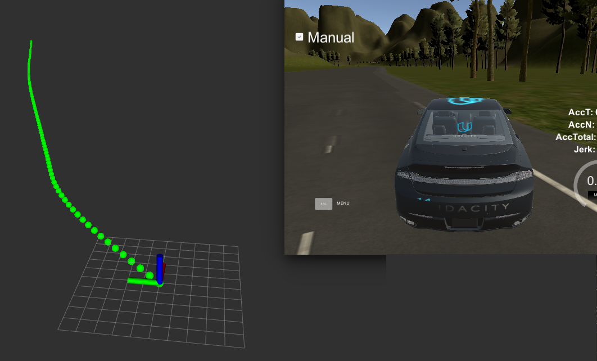
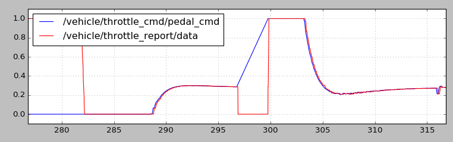

## Self Driving Car Final Project Report

### Team Name: Cruise Control

      _____            _             _____            _             _
     / ____|          (_)           / ____|          | |           | |
    | |     _ __ _   _ _ ___  ___  | |     ___  _ __ | |_ _ __ ___ | |
    | |    | '__| | | | / __|/ _ \ | |    / _ \| '_ \| __| '__/ _ \| |
    | |____| |  | |_| | \__ \  __/ | |___| (_) | | | | |_| | | (_) | |
     \_____|_|   \__,_|_|___/\___|  \_____\___/|_| |_|\__|_|  \___/|_|_

### Team Member Names:
Garrett Pitcher <garrett.pitcher@gmail.com>  
M. M. (need approval)  
Hanqiu Jiang <hanq.jiang@gmail.com>  
Shaun Cosgrove <shaun.cosgrove@bogglingtech.com>  
Wei Guo <guoweist@foxmail.com>

  

### System Architecture

#### Initial Architecture

  

#### Notes

  

#### Generated graph of the resulting nodes, topics and pub-sub details.

### Perception

The basis of the traffic light classification is a Deep Neural Network [Single Shot MultiBox Detector (SSD)](http://www.cs.unc.edu/~wliu/papers/ssd.pdf) architecture. This  classifies the object and detects a bounding box for said object. For greater classification accuracy, we created two models, one trained on simulator images and one trained on images taken from a run around the course on Carla (extracted from a rosbag provided by Udacity). These images were extracted and labeled using the VIA tool (see below). A pre-trained model from [Tensorflow detection model zoo](https://github.com/tensorflow/models/blob/master/research/object_detection/g3doc/detection_model_zoo.md) was re-trained with the [Tensorflow Object Detection API](https://github.com/tensorflow/models/tree/master/research/object_detection).  

Due to a lack of suitable Machine Learning acceleration hardware available among the development team, we chose to process a reduced number of video frames for the traffic light classification. The planner is crafted with this limitation in mind and the end result is a dependable traffic light detection mechanism that strikes a balance between accuracy and performance.

  

The vehicle's point of view as it approaches a set of traffic lights.

### Planning

The Planner takes the high-level information about the world, information about the current and past states of the vehicle and what the vehicle currently perceives, meshes this together and generates both a position and velocity track for the vehicle to follow. Based on the current position of the vehicle, it selects a set of target world way points to visit and using a spline fitting utility, creates intermediate target way points (with associated velocities) for the vehicle to follow. This will ensure that the vehicle is always tracking to a smooth path and will re-track to the center of the lane in case it ever goes off center of the target. The design can be easily extended to enable lane keeping, lane changing or obstacle avoidance; This means operation in a multi-lane environment with other traffic. Traffic lights are processed by determining which set of lights the vehicle needs to obey next and 'looking' at the state of the lights as the vehicle approaches them. Based on the dynamic interaction of the vehicle and the traffic lights, the autopilot assesses the intersection state and chooses an appropriate behavior - prepare to stop, stop or proceed.

RVIZ was used to visualize the generated way-points from the planner.

### Control

A PID controller is used for Throttle and a PD controller is used for braking.

  

### Libraries & Acknowledgements

[Cubic Spline library](https://github.com/AtsushiSakai/pycubicspline) by Atsushi Sakai

[Tensorflow Object Detection](https://github.com/tensorflow/models/tree/master/research/object_detection)

An extremely approachable aritcle, [Racoon Training](https://medium.com/towards-data-science/how-to-train-your-own-object-detector-with-tensorflows-object-detector-api-bec72ecfe1d9) by [Dat Tran](https://github.com/datitran/raccoon_dataset) was used to guide the initial steps into the tensorflow object detection utilities. Tools from his repository were used or modified to create the protobuf binaries for training the object detector. 

[VGG Image Annotator (VIA)](http://www.robots.ox.ac.uk/~vgg/software/via/)

