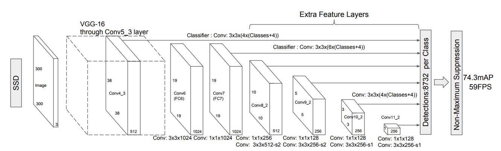

## Self Driving Car Final Project Report

### Team Name: Cruise Control

      _____            _             _____            _             _
     / ____|          (_)           / ____|          | |           | |
    | |     _ __ _   _ _ ___  ___  | |     ___  _ __ | |_ _ __ ___ | |
    | |    | '__| | | | / __|/ _ \ | |    / _ \| '_ \| __| '__/ _ \| |
    | |____| |  | |_| | \__ \  __/ | |___| (_) | | | | |_| | | (_) | |
     \_____|_|   \__,_|_|___/\___|  \_____\___/|_| |_|\__|_|  \___/|_|_

### Team Member Names:
Garrett Pitcher <garrett.pitcher@gmail.com>  
M. M. (need approval)  
Hanqiu Jiang <hanq.jiang@gmail.com>  
Shaun Cosgrove <shaun.cosgrove@bogglingtech.com>  
W. G. (need approval)

  

### System Architecture

  
  

### Perception

A SSD MobileNet architecture is deployed for recorded our traffic light detection. We therefore train our own labeled images on a pretrained model from the [Tensorflow detection model zoo](https://github.com/tensorflow/models/blob/master/research/object_detection/g3doc/detection_model_zoo.md) utilizing the [Tensorflow Object Detection API](https://github.com/tensorflow/models/tree/master/research/object_detection).  

  

### Planning

### Control

  
